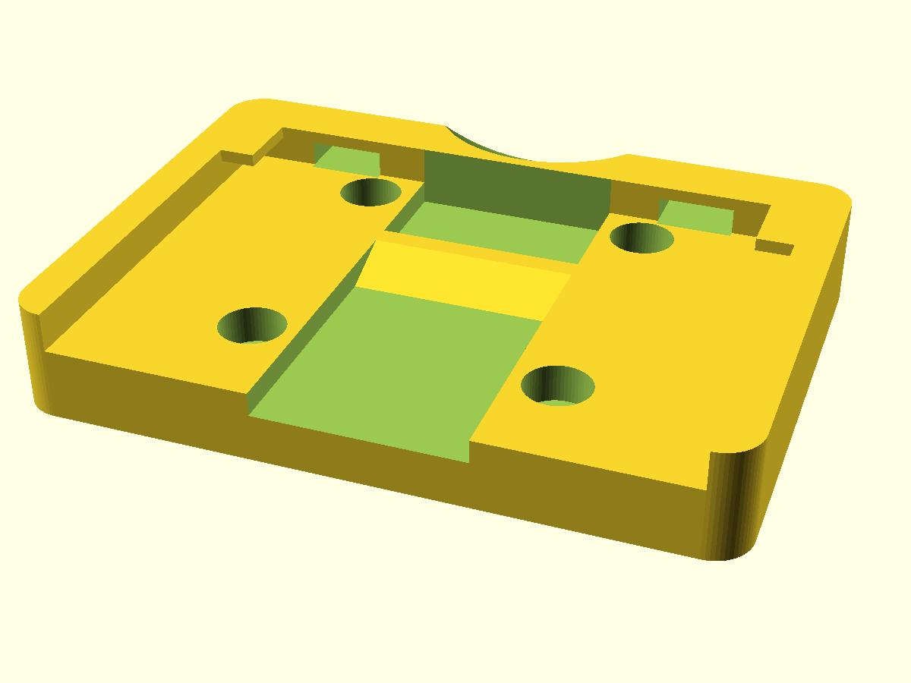
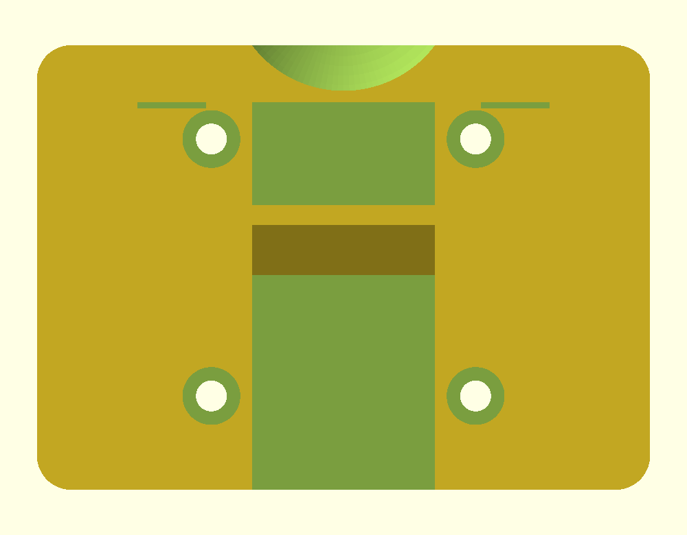
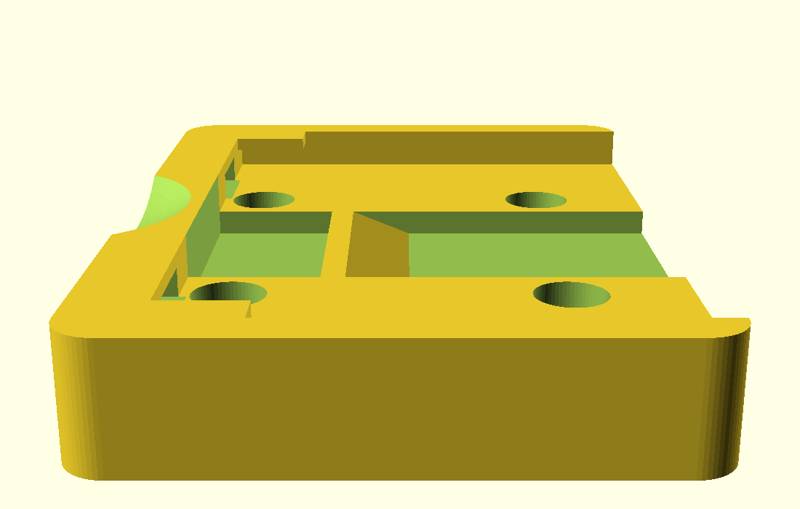

# Bike Basket Adapter Plate

OpenSCAD model of the basket-side mounting plate for a Bontrager Interchange
handlebar basket. This is the plate that screws to the basket and clips onto
the bracket on the bike.



## What it fits

The [Bontrager Interchange Handlebar
Basket](https://www.trekbikes.com/us/en_US/equipment/bike-accessories/bike-baskets/bontrager-interchange-handlebar-basket/p/25614/).
The bike-side bracket carries Japanese and German patent numbers, a Sunny Wheel
Industrial licence notice and a 5 kg rating, so baskets sold under other brands
on the same licensed mount may use this geometry too.

This replaces the basket plate only. The bracket on the bike and its spring
lever need to be intact.

Dimensions came off one plate. Check them against yours before printing.

## How it mounts

Four countersunk screws hold the plate to the basket. The basket then drops
onto the bike-side bracket: the bracket's tongue slides into the slot between
the wings and the plate floor, guided by the central channel, and the spring
lever rides up the ramped latch and drops in behind it.

To release, press the lever through the scoop in the top wall.



## Dimensions

Heights are measured from the flat underside.

| Feature | Value |
|---|---|
| Overall | 107 × 77.7 mm |
| Main surface (screw-hole floor) | 11 mm |
| Channel floor | 7.4 mm |
| Perimeter wall / wing tops | 17 mm |
| Central channel width | 32 mm |
| Channel edge to side wall | 31.5 mm each side |
| Screw holes | 10.1 mm counterbore, 5.4 mm shaft, through |
| Screw hole centres | 46.1 mm across × 44.9 mm down |
| Latch | 8.8 mm ramp + 3.4 mm flat, top flush at 11 mm |
| Latch position | catch face 18 mm from the top wall |
| Wings | 21.6 mm long, 5.8 mm overhang, 2 mm thick |

The original plate is 105 mm wide. This one is 107 mm, which puts 1 mm of
clearance on each side wall and wing. Set `wall_relief = 0` for the original
width.



## Building

Needs [OpenSCAD](https://openscad.org/). A built `basket_adapter_plate.stl` is
included. To regenerate it:

```
openscad -o basket_adapter_plate.stl basket_adapter_plate.scad
```

Every dimension is a named parameter at the top of the .scad file. A few are
marked `not measured` in the source — corner radius, top wall width, finger
scoop — and none of them affect how the plate latches.

## Printing

Print flat on the underside.

The wings cantilever 5.8 mm over a 4 mm gap and need support. The slots through
the top wall bridge 12 mm and print fine without.

PLA is fine for checking fit. Use PETG or ABS for something you'll actually
ride with. The mount is rated for 5 kg, and a printed plate won't match the
moulded original, so leave some margin.

## License

MIT
